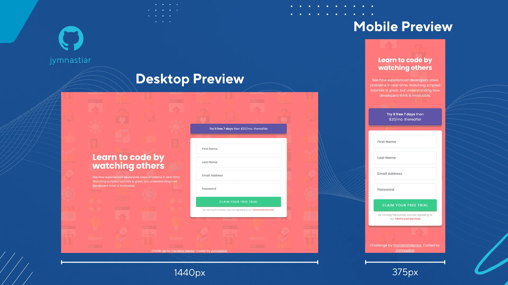

# Frontend Mentor - Intro component with sign up form solution

This is a solution to the [Intro component with sign up form challenge on Frontend Mentor](https://www.frontendmentor.io/challenges/intro-component-with-signup-form-5cf91bd49edda32581d28fd1). Frontend Mentor challenges help you improve your coding skills by building realistic projects. 

## Table of contents

- [Overview](#overview)
  - [The challenge](#the-challenge)
  - [Screenshot](#screenshot)
  - [Links](#links)
- [My process](#my-process)
  - [Built with](#built-with)
  - [What I learned](#what-i-learned)
  - [Continued development](#continued-development)
  - [Useful resources](#useful-resources)
- [Author](#author)

## Overview

### The challenge

Users should be able to:

- View the optimal layout for the site depending on their device's screen size
- See hover states for all interactive elements on the page
- Receive an error message when the `form` is submitted if:
  - Any `input` field is empty. The message for this error should say *"[Field Name] cannot be empty"*
  - The email address is not formatted correctly (i.e. a correct email address should have this structure: `name@host.tld`). The message for this error should say *"Looks like this is not an email"*

### Screenshot

### Links

- [Solution URL](https://github.com/jymnastiar/sign-up-form)
- [Live Site URL](https://sign-up-form-jym.vercel.app/)

## My process

### Built with

- Semantic HTML5 markup
- CSS custom properties
- Flexbox
- CSS Grid
- Mobile-first workflow
- [Tailwind CSS](https://tailwindcss.com/) - Utility-first CSS framework
- Vanilla JavaScript

### What I learned

Simple think about JavaScript DOM manipulation.

### Continued development

practice project to strengthen my DOM manipulation skills in vanilla JavaScript.

### Useful resources

- [BroCode](https://www.youtube.com/@brocodez) This channel helps a lot in mastering JS.
- [Tailwind CSS](https://tailwindcss.com/) This documentation was instrumental in helping me understand how to build layouts using utility classes.

## Author

- Frontend Mentor - [@jymnastiar](https://www.frontendmentor.io/profile/jymnastiar)
- Linkedin - [@jymnastiar](https://www.linkedin.com/in/jymnastiar/)
